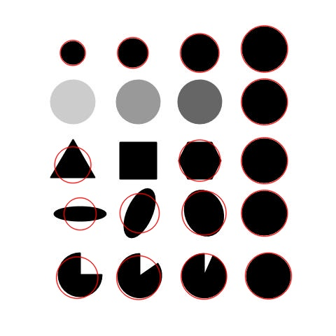
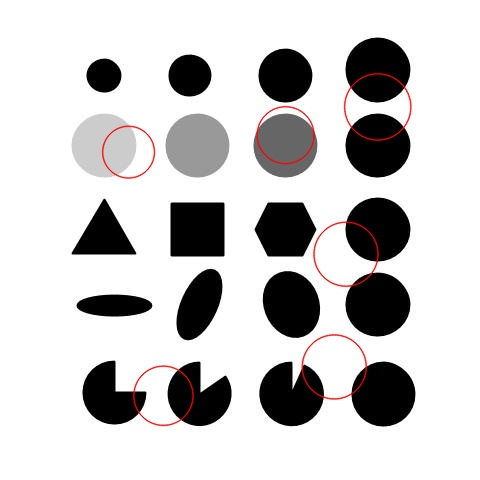

# OpenCV Training Blob Detection
Blob detection using OpenCV.

## Contents :
A Blob is a group of connected pixels in an image that share some common property. There are several types of functions to detect blobs.

| Function        |Action                                                                        |
|----------------:|------------------------------------------------------------------------------|
|cv2.SimpleBlobDetector_create()   |We create the detector.|
|**parameters.filterByColor= True** |Filter by color|
|**parameters.filterByArea = True**|Filter by area|
|**parameters.filterByCircularity = True**|Filter by circularity|
|**parameters.filterByConvexity= True** |Filter by convexity|
|**parameters.filterByInertia = TrueV**|Filter by inertia|

## Test Image used: 
I have used blob.jpg that can be found in the repository.




## Summary:

```python
#Reading the image
image = cv2.imread("blob.jpg",cv2.IMREAD_COLOR)
```
```python
#Set up the detector. SimpleBlobDetector_create() is the new version, 
#SimpleBlobDetector is deprecated.
detector = cv2.SimpleBlobDetector_create()
```
```python
#initialize detector with the image
keypoints = detector.detect(image)
```
```python
#Draw detected blobs as green circles
# cv2.DRAW_MATCHES_FLAGS_DRAW_RICH_KEYPOINTS ensures the size of the circle corresponds to the size of blob
image_with_keypoints = cv2.drawKeypoints(image,keypoints,np.array([]), (0,0,255), cv2.DRAW_MATCHES_FLAGS_NOT_DRAW_SINGLE_POINTS)
```
```python
#Create SimpleBlobDetector with Parameters!
parameters = cv2.SimpleBlobDetector_Params()
```
```python
#Thresholds
parameters.minThreshold=10
parameters.thresholdStep=200
# parameters.maxThreshold=75
```
```python
#Minimum Distance between Blobs
parameters.minDistBetweenBlobs = 150
```
```python
#Define different parameters
#Color Filters
parameters.filterByColor= True
parameters.blobColor= 0
```
```python
#Area filters
parameters.filterByArea = True
parameters.minArea=900
parameters.maxArea=7800
```
```python
#Circularity filter
parameters.filterByCircularity = True
parameters.minCircularity = 0.25
parameters.maxCircularity = 0.985
```
```python
#Convexity filter
parameters.filterByConvexity= True
parameters.minConvexity = 0.185
parameters.maxConvexity = 0.995
```
```python
#Inertia filter
parameters.filterByInertia = True
parameters.minInertiaRatio = 0.01
parameters.maxInertiaRatio = 1
```
```python
#Set up the detector. SimpleBlobDetector_create() is the new version, 
#SimpleBlobDetector is for OpenCV < ver 3.x
detector = cv2.SimpleBlobDetector_create(parameters)
```
