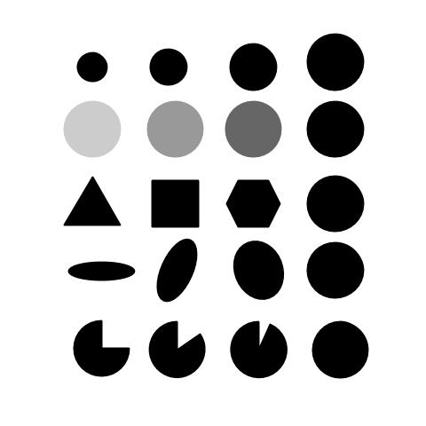

# OpenCV Training Image Thresholding
Global/Binary/Inverse Binary/Truncate/Threshold to Zero/Inverted Threshold Image using OpenCV.

These are the types covered in this repository:

+ Global Thresholding
+ Binary Thresholding
+ Inverse-Binary Thresholding
+ Truncate Thresholding
+ Threshold to Zero
+ Inverted Threshold to Zero

## Contents :
Thresholding therefore has numerous applications in computer vision, and is often performed in the initial stages in  many processing pipelines. There are several types of thresholding algorithms.

| Function        |Action                                                                        |
|----------------:|------------------------------------------------------------------------------|
|cv2.threshold()   |We apply the threshold.|
|**cv2.THRESH_BINARY** | Binary Thresholding|
|**cv2.THRESH_BINARY_INV**| Inverse-Binary Thresholding|
|**cv2.THRESH_TRUNC**       |Truncate Thresholding|
|**cv2.THRESH_TOZERO** | Threshold to Zero|
|**cv2.THRESH_TOZERO_INV**|Inverted Threshold to Zero|

## Test Image used: 
I have used threshold.png that can be found in the repository.




## Summary:

```python
#Reading the image
image = cv2.imread("blob.jpg",cv2.IMREAD_COLOR)
```
```python
#Set up the detector. SimpleBlobDetector_create() is the new version, 
#SimpleBlobDetector is deprecated.
detector = cv2.SimpleBlobDetector_create()
```
```python
#Draw detected blobs as green circles
# cv2.DRAW_MATCHES_FLAGS_DRAW_RICH_KEYPOINTS ensures the size of the circle corresponds to the size of blob
image_with_keypoints = cv2.drawKeypoints(image,keypoints,np.array([]), (0,0,255), cv2.DRAW_MATCHES_FLAGS_NOT_DRAW_SINGLE_POINTS)
```


